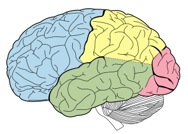

::: tip Basics
:::
## The nerve center
The brain is the nerve impulse center of our body. It contains around 86 billion neurons that transmit information from the body and the outside world. The largest part of the brain is the cerebrum

## The cerebrum
the cerebrum is the thing

### lobes
the cerebrum contains frontal, parietal, temporal and occipital lobes. here is an image.

::: warning Details
From Snell's and other books.
:::

::: danger Advanced
Gray Clinical Neuroanatomy and Youmann and Winn!
:::